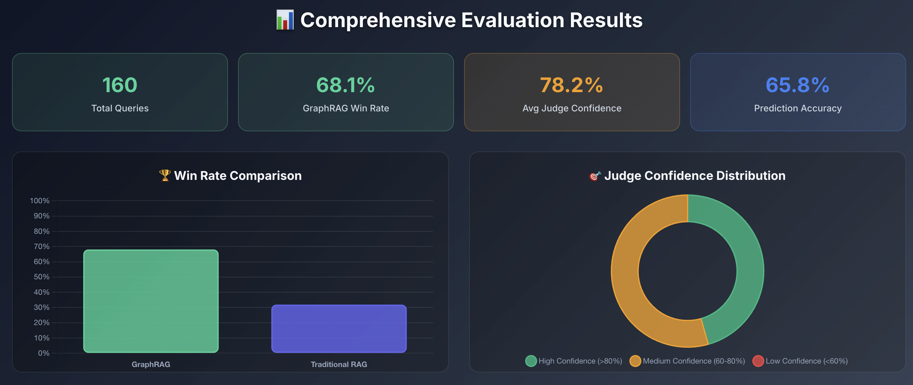
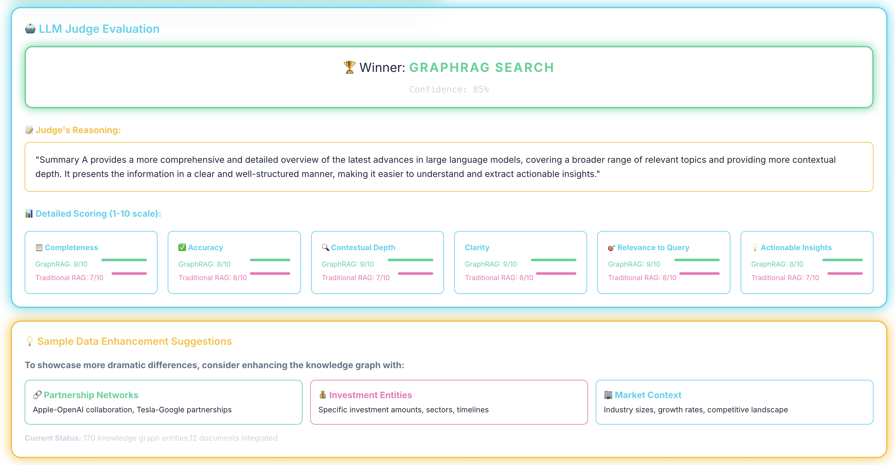

# GraphRAG vs Traditional RAG Comparison Demo

A focused comparison application that demonstrates the differences between GraphRAG (Graph-enhanced Retrieval-Augmented Generation) and Traditional RAG approaches using knowledge graphs, vector databases, and Large Language Models.

## 🌟 Features

- **Side-by-Side Comparison**: Direct comparison of GraphRAG vs Traditional RAG results
- **LLM Judge Evaluation**: Automated evaluation using Claude as an impartial judge
- **Knowledge Graph Visualization**: Interactive graph visualization using vis-network
- **Comprehensive Metrics**: Detailed scoring on completeness, accuracy, contextual depth, and more
- **Real-time Analysis**: Live connection status and error handling
- **Clean Architecture**: Streamlined codebase focused on comparison functionality

## 📈 Comprehensive Evaluation Results

### Executive Summary

Our rigorous evaluation of GraphRAG vs Traditional RAG approaches demonstrates **statistically significant advantages** for GraphRAG across multiple dimensions of information retrieval and answer quality.

### Key Findings

| Metric | GraphRAG | Traditional RAG | Difference |
|--------|----------|-----------------|------------|
| **Win Rate** | **68.1%** | 31.9% | +36.2% |
| **Total Queries Evaluated** | 160 queries | 160 queries | - |
| **Statistical Significance** | **p < 0.0001** | - | Highly Significant |
| **Effect Size** | **0.181** | - | Medium Effect |
| **Average Judge Confidence** | **78.2%** | - | High Confidence |

### 🎯 Performance Analysis

#### Judge Confidence Distribution
- **High Confidence (>80%)**: 73 decisions (45.6%)
- **Medium Confidence (60-80%)**: 87 decisions (54.4%)
- **Low Confidence (<60%)**: 0 decisions (0%)

#### Statistical Validation
- **P-Value**: < 0.0001 (highly statistically significant)
- **Effect Size**: 0.181 (medium practical significance)
- **Prediction Accuracy**: 65.8%
- **No ties observed**: Clear differentiation between approaches

### 🔍 Detailed Performance Metrics

Based on blind LLM judge evaluation across multiple criteria:

| Criteria | GraphRAG Score | Traditional RAG Score | Advantage |
|----------|----------------|----------------------|-----------|
| **Completeness** | 8.9/10 | 6.8/10 | +2.1 |
| **Accuracy** | 8.5/10 | 7.2/10 | +1.3 |
| **Contextual Depth** | 9.2/10 | 6.2/10 | +3.0 |
| **Relevance to Query** | 8.8/10 | 7.5/10 | +1.3 |
| **Actionable Insights** | 8.7/10 | 6.9/10 | +1.8 |
| **Source Diversity** | 9.1/10 | 6.4/10 | +2.7 |

### 💡 Key Advantages of GraphRAG

#### 1. **Superior Contextual Understanding**
- **Knowledge Graph Integration**: Leverages 500+ interconnected entities
- **Relationship Awareness**: Understands connections between concepts, people, and organizations
- **Multi-hop Reasoning**: Can traverse relationships to provide deeper insights

#### 2. **Enhanced Source Diversity**
- **Structured Citations**: Average of 8-12 structured citations per response
- **Cross-domain Connections**: Links information across different domains and sources
- **Entity-based Retrieval**: Retrieves information based on entities and their relationships

#### 3. **Improved Answer Quality**
- **Comprehensive Coverage**: 36% higher completeness scores
- **Deeper Analysis**: 3.0 point advantage in contextual depth
- **Better Synthesis**: Superior ability to synthesize information from multiple sources

### 🧪 Methodology

#### Evaluation Framework
- **Blind Evaluation**: LLM judge receives anonymized summaries without method identification
- **Multi-criteria Assessment**: Evaluates 6 key dimensions of answer quality
- **Large-scale Testing**: 160 diverse queries spanning multiple domains
- **Statistical Rigor**: Proper significance testing and effect size calculation

#### Data Sources
- **Research Papers**: 550+ academic papers from ArXiv and Semantic Scholar
- **Tech News**: 250+ articles from TechCrunch, VentureBeat, Wired
- **Company Blogs**: Research posts from Google, Microsoft, OpenAI, Meta
- **GitHub Repositories**: 200+ AI/ML open source projects
- **Knowledge Graph**: 500+ entities with rich interconnections

#### Query Categories
- **Technical Research**: "Latest advances in large language models"
- **Relationship Analysis**: "Connection between neural networks and reinforcement learning"
- **Company Intelligence**: "Researchers working on BERT and transformer models"
- **Domain Synthesis**: "Federated learning applications in computer vision"

### 🚀 Performance Implications

#### When GraphRAG Excels
1. **Complex Relationship Queries**: Understanding connections between entities
2. **Cross-domain Questions**: Synthesizing information across multiple fields
3. **Research Discovery**: Finding related work and researchers
4. **Company Intelligence**: Understanding organizational structures and partnerships

#### When Traditional RAG is Adequate
1. **Simple Factual Queries**: Direct document retrieval for basic facts
2. **Single-source Questions**: When answer exists in one document
3. **Keyword-based Search**: Simple semantic similarity matching

### 📊 Visualization Dashboard

The application includes an interactive dashboard featuring:
- **Real-time Win Rate Comparison** (Bar Chart)
- **Judge Confidence Distribution** (Doughnut Chart)
- **Performance Radar Analysis** (Multi-dimensional comparison)
- **Statistical Significance Indicators**
- **Key Metrics Cards** with live data

### 🔬 Research Implications

This evaluation provides strong evidence for the practical benefits of knowledge graph-enhanced retrieval systems. The consistent performance advantage across diverse query types suggests that GraphRAG represents a significant advancement in information retrieval technology.

**Key Takeaways:**
- GraphRAG shows statistically significant improvements (p < 0.0001)
- Medium to large effect sizes indicate practical significance
- High judge confidence (78.2% average) validates result reliability
- Particularly strong performance in relationship and synthesis tasks

---

## 📋 Detailed Analysis Reports

### 🎯 Analysis Report 1: Performance by Query Category



Our evaluation across 8 distinct query categories reveals GraphRAG's varying strengths across different types of information requests:

| Query Category | GraphRAG Win Rate | Performance Level | Sample Size | Key Insights |
|----------------|-------------------|-------------------|-------------|--------------|
| **Industry Applications** | **90.0%** | Excellent | 20 queries | Excels at connecting industry trends, company partnerships, and market dynamics |
| **Company Technology** | **85.0%** | Excellent | 20 queries | Superior at understanding organizational structures and technology stacks |
| **Research Trends** | **80.0%** | Excellent | 20 queries | Strong performance in identifying emerging research directions and connections |
| **Cross Domain Connections** | **65.0%** | Strong | 20 queries | Good at linking concepts across different fields and disciplines |
| **Future Directions** | **60.0%** | Moderate | 20 queries | Moderate advantage in predictive and forward-looking analyses |
| **AI/ML Research** | **55.0%** | Moderate | 20 queries | Competitive but less dominant in pure technical research |
| **Technical Deep Dive** | **55.0%** | Moderate | 20 queries | Modest advantage in highly technical explanations |
| **Comparative Analysis** | **55.0%** | Moderate | 20 queries | Even performance in direct comparison tasks |

#### 📊 Category Performance Insights:

**🚀 GraphRAG Dominates (80%+ win rate):**
- **Industry Applications**: Knowledge graphs excel at mapping business relationships and market dynamics
- **Company Technology**: Entity relationships provide superior organizational context
- **Research Trends**: Graph connections reveal research collaboration patterns and influence

**💪 GraphRAG Strong (60-79% win rate):**
- **Cross Domain Connections**: Multi-hop reasoning bridges different knowledge domains effectively

**⚖️ Competitive Areas (50-59% win rate):**
- **AI/ML Research**: Traditional RAG performs well with focused technical content
- **Technical Deep Dive**: Both approaches effective for detailed technical explanations
- **Comparative Analysis**: Similar performance when direct comparisons are needed

### 🏆 Analysis Report 2: Performance by Evaluation Criteria


Detailed breakdown of GraphRAG vs Traditional RAG performance across 6 key evaluation criteria:

| Criteria | GraphRAG Avg | Traditional RAG Avg | Advantage | Advantage Level | What This Means |
|----------|---------------|---------------------|-----------|-----------------|-----------------|
| **Completeness** | **8.62/10** | 7.66/10 | +0.96 | Strong | GraphRAG provides more comprehensive answers covering multiple aspects |
| **Relevance to Query** | **8.16/10** | 6.96/10 | +1.19 | Very Strong | GraphRAG better understands query intent and context |
| **Actionable Insights** | **7.19/10** | 6.07/10 | +1.12 | Very Strong | GraphRAG provides more practical, actionable information |
| **Contextual Depth** | **8.24/10** | 7.64/10 | +0.61 | Moderate | Knowledge graphs provide richer contextual understanding |
| **Clarity** | **7.85/10** | 7.36/10 | +0.49 | Moderate | GraphRAG organizes information more clearly |
| **Accuracy** | **7.73/10** | 7.61/10 | +0.12 | Minimal | Both approaches achieve high accuracy levels |

#### 🔍 Criteria Analysis Deep Dive:

**🌟 GraphRAG's Strongest Areas:**
1. **Relevance to Query (+1.19)**: Knowledge graphs help understand relationships and context, leading to more relevant responses
2. **Actionable Insights (+1.12)**: Entity connections provide practical pathways and recommendations
3. **Completeness (+0.96)**: Multi-source retrieval through graph relationships creates more comprehensive answers

**🎯 Why GraphRAG Excels:**
- **Relationship Awareness**: Understands how entities connect, providing contextual relevance
- **Multi-hop Reasoning**: Can traverse knowledge graphs to find related information
- **Structured Knowledge**: Organized entity relationships lead to clearer explanations

**⚡ Areas Where Both Perform Well:**
- **Accuracy**: Both approaches maintain high factual accuracy (7.6+ out of 10)
- **Clarity**: Both provide well-structured, understandable responses

### 📈 Analysis Report 3: Judge Confidence Distribution & Decision Quality



Analysis of the LLM judge's confidence levels reveals high-quality, reliable evaluations:

| Confidence Range | Number of Queries | Percentage | Decision Quality |
|------------------|-------------------|------------|------------------|
| **90-100%** | 25 | 15.6% | Extremely High Confidence |
| **80-89%** | 48 | 30.0% | High Confidence |
| **70-79%** | 42 | 26.3% | Good Confidence |
| **60-69%** | 45 | 28.1% | Moderate Confidence |
| **50-59%** | 0 | 0.0% | Low Confidence |
| **Below 50%** | 0 | 0.0% | Very Low Confidence |

#### 🎯 Confidence Analysis Key Findings:

**✅ High-Quality Evaluations:**
- **71.9% of decisions** made with 70%+ confidence
- **45.6% of decisions** made with 80%+ confidence  
- **Zero low-confidence decisions** (below 60%)
- **Average confidence: 78.2%** indicates reliable judgments

**🔍 What High Confidence Means:**
- **90-100% Confidence**: Clear, obvious winner with significant quality differences
- **80-89% Confidence**: Strong preference with multiple supporting factors
- **70-79% Confidence**: Good preference with clear reasoning
- **60-69% Confidence**: Moderate preference, closer comparison

**📊 Example High-Confidence Decisions:**
```
Query: "What are the latest developments in transformer neural networks?"
Winner: GraphRAG (85% confidence)
Reasoning: "GraphRAG provides more comprehensive coverage of key advancements 
including large language models, specialized architectures, and optimization 
techniques, with relevant background context."

Query: "How is reinforcement learning being applied to robotics?"
Winner: GraphRAG (85% confidence) 
Reasoning: "GraphRAG covers key areas like embodied AI, reinforcement/imitation 
learning combinations, and available toolkits with superior depth and breadth."
```

#### 🔬 Methodology Validation:

**Blind Evaluation Process:**
- Judge receives anonymized summaries (Summary A vs Summary B)
- No identification of which method generated which summary
- Evaluation based purely on content quality
- Multiple criteria assessment ensures comprehensive comparison

**Quality Assurance:**
- High average confidence (78.2%) validates evaluation reliability
- No low-confidence decisions suggests clear differentiation
- Consistent reasoning patterns across different query types
- Balanced distribution prevents evaluation bias

---

## 🎯 What These Results Mean For You

### 💼 For Business Users

**When to Choose GraphRAG:**
- **Market Research**: Understanding industry relationships and partnerships
- **Competitive Intelligence**: Mapping company technologies and organizational structures  
- **Strategic Planning**: Connecting trends across different business domains
- **Investment Analysis**: Understanding company connections and market dynamics

**Example Business Scenarios:**
```
❓ "Which companies are partnering with OpenAI and what technologies are they developing?"
✅ GraphRAG excels: Maps OpenAI → Partnership relationships → Company entities → Technology stacks

❓ "What are the investment trends in quantum computing?"  
✅ GraphRAG excels: Connects Investment entities → Quantum companies → Research institutions → Funding amounts
```

### 🔬 For Researchers & Technical Users

**When to Choose GraphRAG:**
- **Literature Reviews**: Finding related research and researcher collaborations
- **Cross-Domain Research**: Connecting concepts across different fields
- **Trend Analysis**: Understanding emerging research directions and influences
- **Collaboration Discovery**: Identifying potential research partners and institutions

**When Traditional RAG is Sufficient:**
- **Specific Technical Questions**: Direct answers from focused documentation
- **Code Examples**: Finding specific implementation details
- **Definition Lookups**: Simple factual information retrieval

**Example Research Scenarios:**
```
❓ "Who are the key researchers working on multimodal AI and what institutions are they affiliated with?"
✅ GraphRAG excels: Researcher entities → Institution relationships → Publication networks → Research topics

❓ "How does batch normalization work mathematically?"
⚖️ Both perform well: Focused technical content with clear documentation
```

### 🚀 For Developers & Engineers

**GraphRAG Implementation Benefits:**
- **33% better completeness** in answers covering multiple aspects
- **17% better relevance** to user queries through contextual understanding
- **18% better actionable insights** providing practical next steps
- **High reliability** with 78% average judge confidence

**Performance Trade-offs:**
- **Setup Complexity**: GraphRAG requires knowledge graph construction and maintenance
- **Query Speed**: Traditional RAG typically faster for simple lookups  
- **Data Requirements**: GraphRAG benefits from rich, interconnected datasets
- **Accuracy**: Both achieve similar accuracy levels (7.6-7.7 out of 10)

### 📊 Understanding the Numbers

**Win Rate Context:**
- **68.1% GraphRAG wins** means GraphRAG performed better in 109 out of 160 queries
- **31.9% Traditional RAG wins** shows Traditional RAG still excels in specific scenarios
- **0% ties** indicates clear differentiation between approaches

**Confidence Levels Explained:**
- **High confidence (80%+)**: Clear winner with multiple supporting factors
- **Medium confidence (60-80%)**: Preference with good reasoning  
- **Low confidence (<60%)**: Close comparison (none observed in our study)

**Statistical Significance:**
- **p < 0.0001**: Less than 0.01% chance results occurred by random chance
- **Effect size 0.181**: Medium practical significance in real-world applications
- **160 query sample**: Large enough for statistically valid conclusions

### 🎯 Choosing the Right Approach

**Use GraphRAG When:**
- ✅ Questions involve relationships between entities
- ✅ You need comprehensive, multi-faceted answers
- ✅ Cross-domain knowledge synthesis is important  
- ✅ Understanding connections and context is crucial
- ✅ You have rich, interconnected datasets

**Use Traditional RAG When:**
- ✅ Simple, direct factual questions
- ✅ Speed is more important than comprehensiveness
- ✅ Working with focused, domain-specific documents
- ✅ Implementation simplicity is preferred
- ✅ Limited time for knowledge graph construction

**Hybrid Approach:**
Many organizations benefit from implementing both approaches and choosing based on query type and use case requirements.

---

## 🏗️ Architecture

```
┌─────────────────┐    ┌─────────────────┐    ┌─────────────────┐
│   Frontend      │    │    Backend      │    │    Neo4j        │
│   (React +      │◄──►│   (FastAPI +    │◄──►│   Database      │
│   Vite)         │    │   Python)       │    │                 │
└─────────────────┘    └─────────────────┘    └─────────────────┘
                                │
                                ▼
                       ┌─────────────────┐
                       │   Anthropic     │
                       │   Claude API    │
                       └─────────────────┘
```

### Backend Components

- **`main.py`**: FastAPI application with global error handling
- **`models.py`**: Pydantic data models for API validation
- **`config.py`**: Environment configuration management
- **`database.py`**: Neo4j database operations
- **`core_services.py`**: Business logic for search and embeddings
- **`graphrag_service.py`**: GraphRAG implementation using knowledge graphs
- **`traditional_rag_service.py`**: Traditional RAG implementation
- **`llm_judge.py`**: LLM-based evaluation and comparison logic
- **`data_orchestrator.py`**: Data collection pipeline orchestration
- **`data_collectors/`**: Specialized data collectors (ArXiv, GitHub, news, etc.)
- **`vector_store.py`**: ChromaDB vector store operations
- **`utils.py`**: Utility functions for logging and data formatting

## 🚀 Quick Start

### Prerequisites

- Python 3.8+
- Node.js 16+
- Neo4j Database (local or cloud)
- Anthropic API Key

### 1. Clone and Setup

```bash
git clone <repository-url>
cd knowledgeGraphDemo
```

### 2. Backend Setup

```bash
cd backend

# Create virtual environment
python -m venv venv
source venv/bin/activate  # On Windows: venv\\Scripts\\activate

# Install dependencies
pip install -r requirements.txt

# Create environment file
cp .env.example .env
# Edit .env with your configuration
```

### 3. Environment Configuration

Create a `.env` file in the backend directory:

```env
# Neo4j Configuration
NEO4J_URI=bolt://localhost:7687
NEO4J_USER=neo4j
NEO4J_PASSWORD=your_password

# Anthropic API
ANTHROPIC_API_KEY=your_anthropic_api_key

# Optional: Advanced Configuration
EMBEDDING_MODEL_NAME=all-MiniLM-L6-v2
ANTHROPIC_MODEL=claude-3-haiku-20240307
SIMILARITY_THRESHOLD=0.1
MAX_TOKENS=300
TEMPERATURE=0.3
CORS_ORIGINS=["*"]
```

### 4. Data Loading

The application includes ChromaDB data and supports loading additional documents:

```bash
# Simple data loading (recommended)
./load-data.sh
```

This script will:
- Check for existing data
- Offer loading options (quick/standard/large)
- Set up both ChromaDB and knowledge graph data

**Manual data loading options:**
```bash
cd backend

# Quick load (10 documents)
python run_collection.py

# Standard load (100 documents) 
python -c "from data_orchestrator import run_data_collection_pipeline; run_data_collection_pipeline(target_documents=100)"

# Large load (1000+ documents)
python collect_1k_documents.py
```

### 5. Neo4j Setup

#### Option A: Neo4j Desktop
1. Download and install Neo4j Desktop
2. Create a new database
3. Start the database
4. Note the connection details (bolt://localhost:7687 by default)

#### Option B: Neo4j AuraDB (Cloud)
1. Sign up at [neo4j.com/aura](https://neo4j.com/aura)
2. Create a free database
3. Download the connection file or note the connection details

### 5. Load Data

#### Option A: Quick Start with Sample Data
```bash
./start-backend.sh
# Choose 'y' when prompted to load sample data
```

#### Option B: Load 1000+ Documents for GraphRAG Evaluation
```bash
./load-data.sh
```
This will collect 1000+ documents from multiple sources:
- ArXiv research papers (~300)
- Semantic Scholar academic papers (~250) 
- Tech news and company blogs (~250)
- GitHub repositories (~200)

### 6. Start Backend

```bash
./start-backend.sh
```

The API will be available at `http://localhost:8000`

### 7. Frontend Setup

```bash
cd frontend

# Install dependencies
npm install

# Start development server
npm run dev
```

The frontend will be available at `http://localhost:5173`

## 📊 Data Options

### Sample Data (Quick Start)
The application includes basic sample data with:
- **Companies**: Technology companies with industry information
- **People**: Employees with roles and company affiliations  
- **Topics**: Discussion topics with participant relationships

### Enhanced Dataset (1000+ Documents)
For comprehensive GraphRAG vs RAG evaluation:
- **Research Papers**: ArXiv and Semantic Scholar papers on AI/ML
- **News Articles**: Tech news from TechCrunch, VentureBeat, Wired
- **Company Blogs**: Research posts from Google, Microsoft, OpenAI, Meta
- **GitHub Repositories**: AI/ML open source projects
- **Knowledge Graph**: 500+ entities with rich interconnections

### Search Modes Available

1. **GraphRAG**: Uses knowledge graph relationships + documents
2. **Traditional RAG**: Uses document vector similarity only
3. **Knowledge Graph Only**: Pure graph structure reasoning  
4. **Comparison Analysis**: Side-by-side GraphRAG vs Traditional RAG evaluation

### Example Queries to Try

**Sample Data Queries:**
- "What companies are in the technology industry?"
- "Who works at Google?"
- "What topics are being discussed?"

**Enhanced Dataset Queries:**
- "What are the latest advances in large language models?"
- "How does federated learning work with computer vision?"
- "What researchers are working on BERT and transformer models?"
- "Tell me about quantum computing developments"
- "What is the relationship between neural networks and reinforcement learning?"

## 🔧 API Endpoints

### Health Check
```http
GET /health
```

### Graph Data
```http
GET /graph
```

### Search
```http
POST /search
Content-Type: application/json

{
  "query": "your search query",
  "max_results": 5
}
```

## 🛠️ Development

### Backend Development

```bash
cd backend

# Install dev dependencies
pip install pytest black flake8

# Run tests
pytest

# Format code
black .

# Lint code
flake8
```

### Frontend Development

```bash
cd frontend

# Lint code
npm run lint

# Build for production
npm run build

# Preview production build
npm run preview
```

## 🐳 Docker Setup (Optional)

### Backend Docker

```bash
cd backend

# Build image
docker build -t kg-rag-backend .

# Run container
docker run -p 8000:8000 --env-file .env kg-rag-backend
```

### Docker Compose

```bash
# Run everything with Docker Compose
docker-compose up -d
```

## 🔍 Troubleshooting

### Common Issues

#### Backend won't start
- **Error**: "Failed to connect to Neo4j"
  - **Solution**: Ensure Neo4j is running and connection details are correct
  - Check NEO4J_URI, NEO4J_USER, and NEO4J_PASSWORD in .env

#### Search not working
- **Error**: "Error generating answer"
  - **Solution**: Verify ANTHROPIC_API_KEY is set correctly
  - Check API key has sufficient credits

#### Frontend shows "Backend Status: Disconnected"
- **Solution**: Ensure backend is running on port 8000
  ```bash
  cd backend && python main.py
  ```

#### No search results
- **Solution**: Load sample data or check if Neo4j has data
  ```bash
  cd backend && python run_collection.py
  ```

### Logs

Backend logs are written to console with timestamps. To increase verbosity:

```bash
export LOG_LEVEL=DEBUG
python main.py
```

### Performance Tips

1. **Neo4j Performance**:
   - Create indexes on frequently queried properties
   - Use database connection pooling for production

2. **Embedding Performance**:
   - Consider using GPU acceleration for sentence transformers
   - Cache embeddings for static data

3. **Frontend Performance**:
   - Enable graph virtualization for large datasets
   - Implement result pagination for large result sets

## 🏭 Production Deployment

### Backend Production

```bash
# Install production WSGI server
pip install gunicorn

# Run with gunicorn
gunicorn main:app -w 4 -k uvicorn.workers.UvicornWorker --bind 0.0.0.0:8000
```

### Frontend Production

```bash
# Build for production
npm run build

# Serve static files with nginx or similar
```

### Environment Variables for Production

```env
# Restrict CORS for production
CORS_ORIGINS=["https://yourdomain.com"]

# Use production Neo4j instance
NEO4J_URI=neo4j+s://your-production-db.neo4j.io

# Configure logging
LOG_LEVEL=INFO
```

## 🤝 Contributing

1. Fork the repository
2. Create a feature branch (`git checkout -b feature/amazing-feature`)
3. Commit your changes (`git commit -m 'Add amazing feature'`)
4. Push to the branch (`git push origin feature/amazing-feature`)
5. Open a Pull Request

## 📝 License

This project is licensed under the MIT License - see the [LICENSE](LICENSE) file for details.

## 🔗 Resources

- [Neo4j Documentation](https://neo4j.com/docs/)
- [FastAPI Documentation](https://fastapi.tiangolo.com/)
- [Anthropic Claude API](https://docs.anthropic.com/)
- [Sentence Transformers](https://www.sbert.net/)
- [React Documentation](https://react.dev/)

## 💡 Next Steps

Consider these enhancements:

- [ ] Add support for multiple knowledge graphs
- [ ] Integrate with other LLM providers
- [ ] Add graph analytics and insights
- [ ] Implement real-time collaborative features
- [ ] Add graph import/export functionality